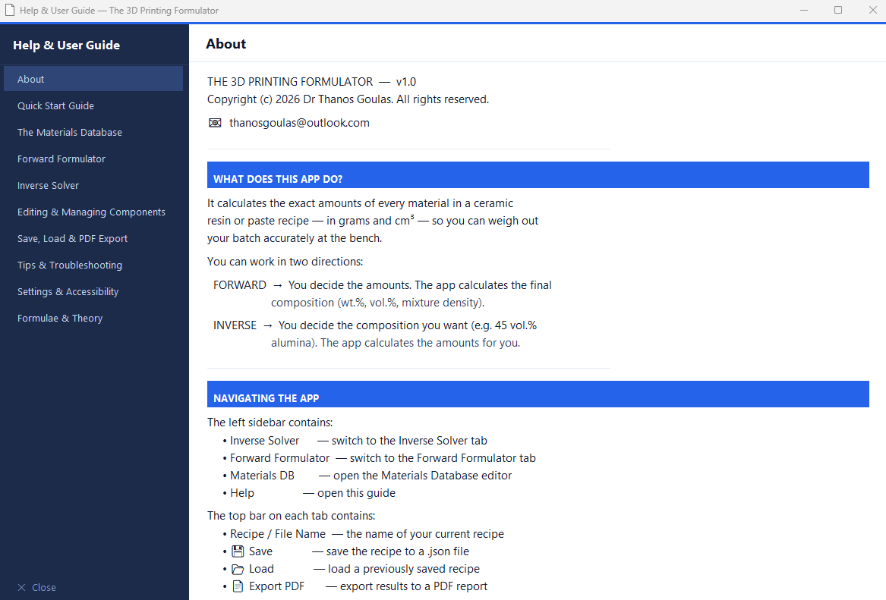

## ⬇️ Download

> **The 3D Printing Formulator is free to download and use for academic 
> and non-commercial research purposes.**

📦 **[Download the latest version (v1.0) here](https://doi.org/10.5281/zenodo.19321774)**

> Requires Windows. No installation needed — just download and run the `.exe`.

---

# The 3D Printing Formulator

**Version 1.0**

A standalone desktop application for the design and optimisation of
ceramic resin and paste formulations for 3D printing.

---

## Author

**Dr Athanasios Goulas**
2026

> This software was developed independently by the Author in personal
> time, using personal resources. It is not affiliated with, nor a
> deliverable of, any funded research project or institutional programme.

---

## Description

The 3D Printing Formulator is a desktop tool designed to assist
researchers and practitioners in formulating ceramic resins and pastes
for additive manufacturing. It provides a structured, user-friendly
interface for calculating and optimising formulation parameters.

The tool works in two directions:

- **Forward Formulator** — you decide the amounts, the app calculates
  the final composition (wt.%, vol.%, mixture density)
- **Inverse Solver** — you decide the composition you want, the app
  calculates the amounts for you

Additional features include a built-in Materials Database, PDF export,
save/load functionality, and a comprehensive Help & User Guide.

---

## Screenshots

### Main Interface

### Materials Database

### Help & User Guide

---

## Download

The compiled Windows executable (.exe) is available for download via
the Zenodo record:

📦 📦 **[Download The 3D Printing Formulator v1.0](https://doi.org/10.5281/zenodo.15321774)**

---

## Licence

This software is released under a proprietary licence.
See [LICENSE.txt](LICENSE.txt) for full terms.

In summary:
- ✅ Free to use for personal, academic and non-commercial research
- ✅ Must be cited in any publication that uses it
- ❌ No commercial use without written permission
- ❌ No modification or redistribution without written permission
- ❌ No claiming as institutional or project output

---

## Citation

If you use this software in your research, please cite it as:

Goulas, A. (2026). The 3D Printing Formulator (v1.0).
[Software]. https://doi.org/10.5281/zenodo.15321774

---

## Contact

For licensing, permissions, or enquiries, contact the Author directly:
thanosgoulas@outlook.com
