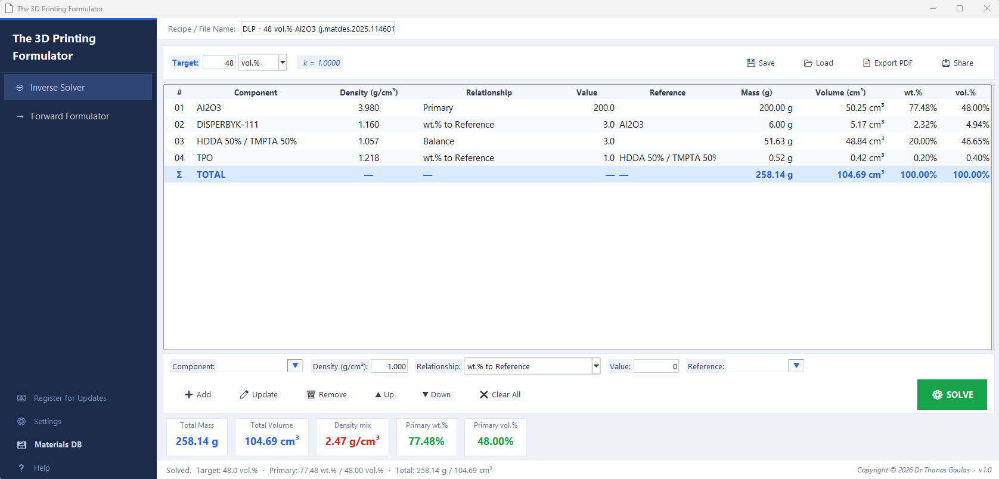
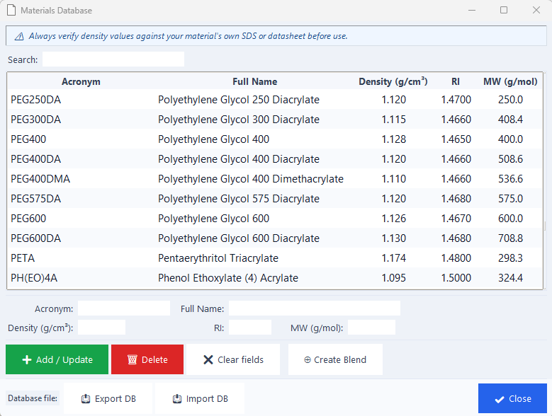

# The 3D Printing Formulator

**Version 1.0** | Developed by Dr Athanasios Goulas | © 2026 All Rights Reserved

---

## ⬇️ Download

> **Free to download and use for academic and non-commercial research purposes.**

📦 **[Download The 3D Printing Formulator v1.0](https://doi.org/10.5281/zenodo.19321774)**

> **Installation:** No installation required. Download the `.zip` file,
> extract it, and run `3D Printing Formulator.exe` directly.
>
> **System requirements:** Windows 10 or later.
>
> ⚠️ **Windows Security Note:** Windows may show a SmartScreen warning.
> To proceed:
> 1. Click **"More info"**
> 2. Click **"Run anyway"**
>
> The software is safe and open source — you can verify the source code
> directly in this repository.

---

## Author

**Dr Athanasios Goulas**
2026

> This software was developed independently by the Author in personal
> time, using personal resources. It is not affiliated with, nor a
> deliverable of, any funded research project or institutional programme.

---

## Description

The 3D Printing Formulator is a standalone desktop application designed
to assist researchers and practitioners in formulating ceramic resins
and pastes for additive manufacturing. It provides a structured,
user-friendly interface for calculating and optimising formulation
parameters.

The tool works in two directions:

- **Forward Formulator** — you decide the amounts, the app calculates
  the final composition (wt.%, vol.%, mixture density)
- **Inverse Solver** — you decide the composition you want, the app
  calculates the amounts for you

Additional features include:
- Built-in Materials Database with editable entries
- PDF export of results
- Save/Load functionality for recipes
- Comprehensive built-in Help & User Guide

---

## Screenshots

### Main Interface

### Materials Database

### Help & User Guide
![Help and User Guide
